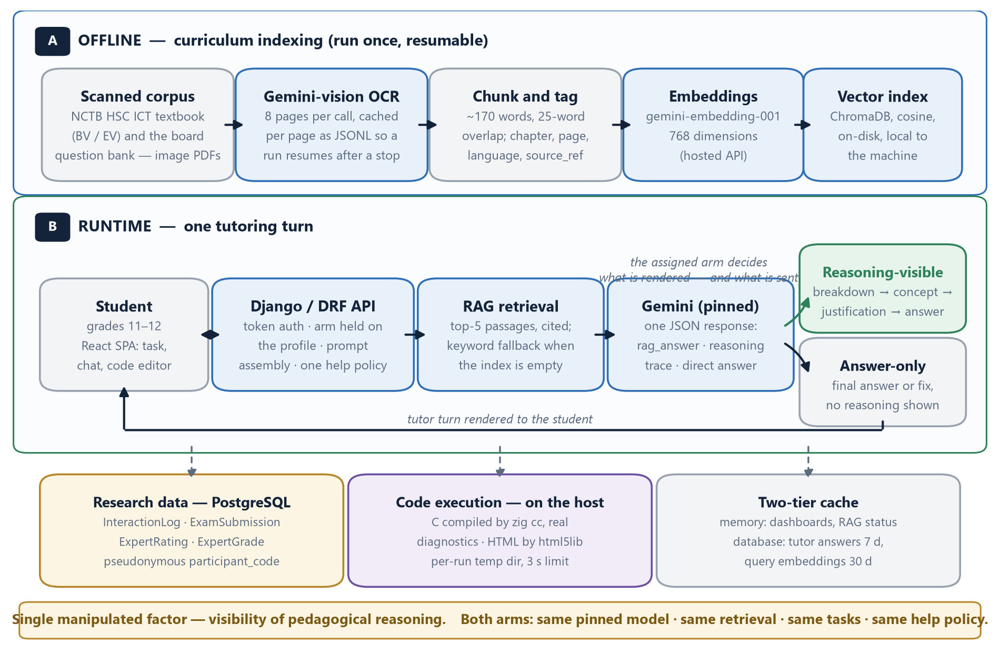
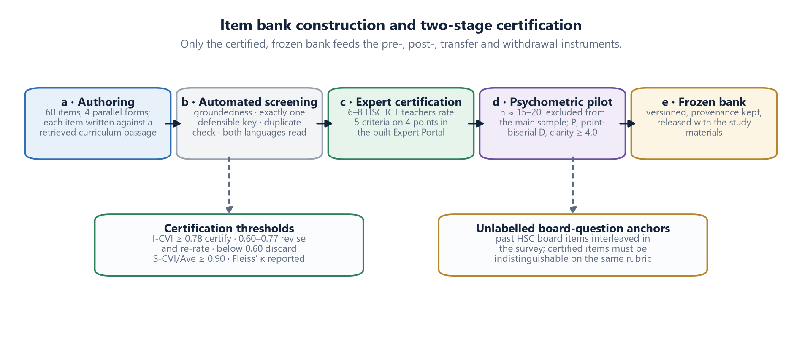

# TRACE Tutor

**A reasoning-transparent AI tutor for HSC ICT, built as a controlled-experiment platform.**

[](https://www.python.org/)
[](https://www.djangoproject.com/)
[](https://react.dev/)
[](https://vitejs.dev/)
[](https://www.postgresql.org/)

TRACE Tutor is the research instrument for a between-subjects study asking a single question: **when an AI tutor shows its reasoning instead of just its answer, do students learn more and depend on it less?**

The platform runs two tutor modes that are identical in every respect except one — whether the model's pedagogical reasoning is rendered to the student. Both call the same pinned model, retrieve the same curriculum passages, solve the same tasks, and follow the same help policy. Everything students do is logged for analysis.

It is built for the Bangladesh NCTB Higher Secondary ICT syllabus (Chapter 4 — Web Design & HTML, Chapter 5 — C Programming, Chapter 6 — Database Management), with a Bangla-first interface.

---

## Contents

- [How it works](#how-it-works)
- [Features](#features)
- [Tech stack](#tech-stack)
- [Quick start](#quick-start)
- [Configuration](#configuration)
- [Building the curriculum index](#building-the-curriculum-index)
- [Project structure](#project-structure)
- [API reference](#api-reference)
- [Research design](#research-design)
- [Security and deployment](#security-and-deployment)
- [Project status](#project-status)
- [Citation](#citation)

---

## How it works



**Offline.** The NCTB textbooks are scanned image PDFs — no text can be extracted from them directly. An ingestion pipeline transcribes them page by page with a vision model, caching each page as it goes so an interrupted run resumes instead of restarting. Transcribed pages are chunked (~170 words, 25-word overlap), tagged with chapter, page and language, embedded, and stored in a local ChromaDB index.

**At run time.** Each tutor turn retrieves the five most relevant passages, prompts one pinned model, and returns a structured response containing a textbook-grounded answer with its page citation, an independent reasoning trace, and a short direct answer. The participant's assigned arm determines what is rendered.

**Grounding is visible.** Every answer carries the textbook rule it applied, a citation such as `NCTB HSC ICT (BV) p.146`, and a `grounded` flag the model must set to `false` when the retrieved passages do not actually cover the question.

---

## Features

| Capability | What it does |
| --- | --- |
| **Dual-mode tutor** | `REASONING_VISIBLE` renders problem breakdown → concept per step → justification → worked solution. `ANSWER_ONLY` renders the answer alone. One model, one prompt, one help policy. |
| **Curriculum RAG** | ChromaDB vector search over the OCR'd NCTB corpus, with keyword retrieval as a fallback so the tutor never answers ungrounded without saying so. |
| **Real code execution** | C is compiled with a real toolchain and compiler diagnostics are mapped to editor squiggles. HTML is validated with a standards HTML5 parser, and task requirements are checked as CSS selectors. Nothing is simulated. |
| **Monaco editor** | Debounced background syntax checking, inline diagnostics, a streaming build log, and per-test results. |
| **Assessment suite** | Four parallel 15-item forms — pre, post, transfer, withdrawal — mixing concept MCQs, code tracing and code writing. |
| **Interaction telemetry** | Help requests, code runs and results, copy events, submissions and session boundaries, each tagged with the participant's arm. |
| **Expert portal** | A five-criterion content-validity rubric (alignment, accuracy, clarity, difficulty, answerability) for teacher review of items. |
| **Researcher dashboard** | Participant counts, arm balance, engagement aggregates and RAG index status. |
| **Bangla-first UI** | Bangla interface copy with English technical terms retained; the tutor answers in the participant's chosen language while keeping code and error messages in English. |

---

## Tech stack

| Layer | Choice | Why |
| --- | --- | --- |
| API | Django 5 + Django REST Framework | Token auth, admin, ORM and migrations out of the box |
| Database | PostgreSQL (SQLite fallback) | Concurrent writes during background ingestion; self-hosted so participant data stays local |
| Vector store | ChromaDB, embedded | No server to run, on-disk persistence, metadata filtering — right-sized for a few thousand passages |
| LLM | Gemini Flash tier | Reliable JSON-mode output, strong Bangla, long context, version-pinnable |
| Embeddings | `gemini-embedding-001`, 768-d | Bilingual coverage without a local GPU; query vectors cached 30 days |
| Frontend | React 18 + Vite 6 + Tailwind | Fast dev loop; CSS-variable theming |
| Editor | Monaco | Real diagnostics, custom themes matched to the app |
| C compiler | `ziglang` (`python -m ziglang cc`) | A pip-installable Clang, so school machines need no system toolchain |
| HTML checking | `html5lib` + BeautifulSoup | Real HTML5 parse errors, translated into student-friendly messages |

---

## Quick start

### Prerequisites

- Python 3.11+
- Node.js 18+
- PostgreSQL 16+ *(optional — set `USE_POSTGRES=0` to use SQLite)*
- A Gemini API key

### 1. Backend

```bash
cd backend
python -m venv .venv
.venv\Scripts\activate          # Windows
# source .venv/bin/activate     # macOS / Linux

pip install -r requirements.txt
pip install Pillow              # required for avatar uploads
```

Create `backend/.env` from the template (see [Configuration](#configuration)), then:

```bash
cp .env.example .env            # then fill in GEMINI_API_KEY and STAFF_ACCESS_CODE
python manage.py migrate
python manage.py createsuperuser
python manage.py runserver 8000
```

> `DEBUG` defaults to **off**. Set `DEBUG=1` in `backend/.env` for local development, or the
> server will demand a real `SECRET_KEY` and mark cookies TLS-only.

### 2. Frontend

```bash
cd frontend
npm install
npm run dev
```

Open **<http://localhost:3000>**. The Vite dev server proxies `/api` and `/media` to port 8000.

### 3. Register

Students register directly. Teacher and researcher accounts require the staff access code from your `.env`.

> **Note on the compiler.** The first C compilation takes about two minutes while Zig builds libc; every compile after that is under a second. If you have `gcc` or `clang` installed, they are used instead.

---

## Configuration

Copy `backend/.env.example` to `backend/.env` and fill it in. **Never commit `.env`** — it is excluded by `.gitignore`.

| Variable | Default | Purpose |
| --- | --- | --- |
| `GEMINI_API_KEY` | — | **Required.** Tutor, OCR and embeddings |
| `ARM_SWITCH_POLICY` | `after_protocol` | When a participant may switch tutor mode: `after_protocol` (only once all four papers are in), `never`, or `always` (pilots/demos). The enrolment arm is recorded permanently either way. |
| `STAFF_ACCESS_CODE` | *(empty)* | Required to register a teacher or researcher account. Empty means staff registration is **refused**, never "any code will do". |
| `DEBUG` | `0` | `1` for local development. Drives error pages, host checking, CORS and media serving. |
| `SECRET_KEY` | — | **Required when `DEBUG=0`** — the server refuses to start without it. Signs sessions and the research device cookie. |
| `ALLOWED_HOSTS` | `localhost,127.0.0.1` | Comma-separated hostnames Django will answer to |
| `HTTPS_ONLY` | `not DEBUG` | TLS-only cookies + http→https redirect. **Set `0` for a plain-http lab server** or nobody can log in. |
| `BEHIND_TLS_PROXY` | `0` | Set when a reverse proxy terminates TLS and forwards `X-Forwarded-Proto` |
| `SERVE_MEDIA` | `= DEBUG` | Let Django serve `backend/media/` (avatars) |
| `CSRF_TRUSTED_ORIGINS` | `http://localhost:3000,...` | Comma-separated |
| `CORS_ALLOWED_ORIGINS` | *(= CSRF origins)* | Ignored when `DEBUG=1`, which allows all origins |
| `USE_POSTGRES` | `0` | `1` for PostgreSQL, `0` for the SQLite fallback |
| `DB_NAME` | `trace_tutor_db` | Database name |
| `DB_USER` / `DB_PASSWORD` | `postgres` / `postgres` | Credentials |
| `DB_HOST` / `DB_PORT` | `localhost` / `5432` | Connection |
| `GEMINI_MODEL` | `gemini-3.6-flash` | Generation model. Pin this for a study. |
| `GEMINI_FALLBACK_MODELS` | *(empty)* | Tried on quota or availability errors. Empty by default so no participant is silently served a different model. |
| `GEMINI_TEMPERATURE` | `0` | Sampling temperature for tutor turns. Zero keeps the manipulation identical across participants. |
| `GEMINI_EMBED_MODEL` | `gemini-embedding-001` | Embedding model |
| `GEMINI_EMBED_DIMENSIONS` | `768` | Embedding size |
| `TUTOR_ANSWER_CACHE_SECONDS` | `604800` | How long identical tutor answers are reused |
| `C_COMPILER` | *(auto-detect)* | Override the compiler executable |

> The model chain and the temperature both default to the values a controlled run needs:
> one pinned model, no fallbacks, no sampling. Set `GEMINI_FALLBACK_MODELS` only if you
> would rather the tutor degrade to another model than return its offline fallback answer.

### Code sandbox

| Variable | Default | Purpose |
| --- | --- | --- |
| `CODE_SANDBOX` | `auto` | `auto`, `docker`, `rlimit` or `none`. `auto` picks the strongest available. |
| `CODE_SANDBOX_REQUIRED` | `not DEBUG` | Refuse to execute when no sandbox is available, instead of running unprotected |
| `CODE_SANDBOX_IMAGE` | `trace-tutor-runner:1` | Image built from `backend/tutor/sandbox.Dockerfile` |
| `CODE_RUN_MEMORY_MB` | `256` | Memory cap on the student's program |
| `CODE_RUN_MAX_PROCESSES` | `64` | Process cap — this is what stops a fork bomb |
| `CODE_COMPILE_MEMORY_MB` | `1024` | Compiling legitimately needs more room than running |

### Exam grading and a whole cohort submitting at once

A submission is persisted the instant it arrives, with no score, and graded afterwards -
grading a form compiles five C programs, and a lab session ends with everyone pressing
Submit inside the same minute. The client polls `GET /api/assessment/submissions/<id>/`
until `grading_status` is `graded` (or `failed`, which keeps the answers and shows the
error to staff). Nothing a participant submits can be lost to a slow or failing compiler.

| Variable | Default | Purpose |
| --- | --- | --- |
| `GRADING_MODE` | `thread` | `thread`: grade on background threads in the web process. `worker`: the web process only queues; run `python manage.py grade_submissions` to compile. |
| `GRADING_CONCURRENCY` | CPU count | Submissions graded side by side |

Measured on a 16-CPU Windows laptop against PostgreSQL, compiling on the host toolchain
(the `docker` sandbox tier adds container start-up per compile, so expect longer marking
times there), with every participant submitting in the same instant (`TRACE_LOAD_TEST=<n> python manage.py test assessment.tests.test_load`):

| Cohort | Saved | Graded | Submit request p95 | Everyone has marks by |
| --- | --- | --- | --- | --- |
| 30 | 30/30 | 30/30 | 3.5 s | 41 s |
| 60 | 60/60 | 60/60 | 5.7 s | 76 s |

The Submit latency there is the *test harness* - Django's single-process development
server serving 60 simultaneous requests; a do-nothing endpoint costs the same 4.6 s
under that burst. Two deployment rules follow:

- **Run a live cohort on PostgreSQL, not the SQLite fallback.** SQLite is fine for
  development; under 30 concurrent submissions it lost rows.
- **Serve with several web workers** (e.g. `gunicorn -w 4`, or `waitress --threads=8` on
  Windows) and, on a shared server, `GRADING_MODE=worker` with the grading command in its
  own process so compiles never contend with requests.

### Rate limits

The expensive endpoints are throttled per user (`backend/trace_backend/throttles.py`): the tutor
at 30/min, code execution at 60/min, and curriculum ingestion at 5/hour. Anonymous callers get
60/min and can only reach register/login.

---

## Building the curriculum index

Place the source PDFs in `RAG/`. They are **not** included in this repository — they are copyrighted textbooks, and you must supply your own copies:

```text
RAG/
├── HSC ICT (BV).pdf      # Bangla version
├── HSC ICT (EV).pdf      # English version
└── HSC ICT QB 26.pdf     # Board question bank
```

Then run the ingestion:

```bash
cd backend
python manage.py ingest_rag                       # everything
python manage.py ingest_rag --pages 140-170       # a page range
python manage.py ingest_rag --index-only          # skip OCR, index the cache
python manage.py ingest_rag --reindex             # rebuild the vector index
```

OCR output is cached per page in `backend/data/ocr/*.jsonl`, so a run that stops — quota, network, restart — resumes where it left off rather than re-spending API calls. Progress is visible at `/admin/rag` in the app, or via `GET /api/curriculum/status/`.

Until the index is built the tutor still answers, using keyword retrieval over seed passages, and marks its answers as ungrounded.

---

## Project structure

```text
├── backend/
│   ├── accounts/       # participants, profiles, auth, research covariates
│   ├── assessment/     # item bank, exam submissions, expert ratings
│   │   └── item_bank.json      # 60 items across 4 parallel forms
│   ├── curriculum/     # RAG engine, OCR ingestion, vector index
│   ├── logging_app/    # interaction telemetry, dashboard aggregates
│   ├── tutor/          # tutor endpoint, code runner, HTML checker
│   └── trace_backend/  # settings, caching, cookie middleware
├── frontend/
│   └── src/
│       ├── components/ # editor, tutor panels, layout, UI primitives
│       ├── context/    # auth, theme
│       ├── pages/      # workspace, dashboard, assessment, expert, admin
│       └── services/   # API client
├── docs/               # architecture figures
└── RAG/                # source PDFs (not committed)
```

---

## API reference

All endpoints are prefixed `/api/`.

| Method | Endpoint | Purpose |
| --- | --- | --- |
| `POST` | `accounts/register/` · `login/` · `logout/` | Enrolment and authentication |
| `GET` `PATCH` | `accounts/profile/` | Covariates, language, consent |
| `POST` `DELETE` | `accounts/avatar/` | Profile picture |
| `GET` | `accounts/my-data/` | Everything held about the caller (right of access) |
| `POST` | `accounts/withdraw/` | Leave the study: erases the participant's data, closes the account |
| `POST` | `admin/participants/<code>/withdraw/` | The same erasure, actioned by a researcher for a withdrawal received offline |
| `POST` | `tutor/query/` | One tutoring turn — retrieval, generation, arm-filtered response |
| `POST` | `code/run/` | Compile and run a submission |
| `GET` | `code/status/` | Compiler availability |
| `GET` | `assessment/items/?type=pre` | Serve an exam form |
| `POST` | `assessment/submit/` | Save a submission (graded in the background) |
| `GET` | `assessment/submissions/<id>/` | Poll a submission's grading state and results (owner or staff) |
| `GET` | `expert/certification/` | Item certification report: I-CVI, modified kappa, S-CVI, difficulty, discrimination, KR-20 |
| `POST` | `telemetry/log/` | Append a behavioural event |
| `GET` | `dashboard/` | Participant progress summary |
| `POST` | `curriculum/search/` · `ingest/` | Retrieval and index building |
| `GET` | `curriculum/status/` · `passages/` | Index inspection |
| `GET` `POST` | `expert/reviews/` · `rating/` | Content-validity survey |
| `GET` | `admin/stats/` | Researcher aggregates, computed from the collected data |
| `GET` | `admin/export/` | Streams the per-participant dataset as CSV |

Everything except `accounts/register/` and `accounts/login/` requires a token. `curriculum/search/`
and `curriculum/passages/` are staff-only; `curriculum/ingest/`, `admin/stats/` and `admin/export/`
are researcher-only.

---

## Research design



**Two arms.** Participants are allocated to `REASONING_VISIBLE` or `ANSWER_ONLY` at registration, balanced across arms. The arm is held server-side on the profile.

**Four instruments.** Pre-test, post-test, transfer and withdrawal — 15 items each, matched on composition (7 concept MCQs, 5 C tasks, 3 HTML tasks). The primary outcome is the total form score; per-chapter subscales are descriptive only.

**Three outcomes.**

- *Learning gain* — normalized gain ⟨g⟩ = (post − pre) / (100 − pre)
- *Transfer* — structurally novel problems, without tutor access
- *Dependency* — the performance drop when the tutor is withdrawn, plus behavioural logs and self-report

**Logged events.** `WORKSPACE_ENTER`, `HELP_REQUEST`, `CODE_RUN`, `CODE_RESULT`, `COPY_PASTE`, `SUBMIT_ASSESSMENT`, `ARM_SWITCH`, `LOGIN` / `LOGOUT` / `REGISTER` — each with the arm, the problem id, and a signed anonymous device id.

**Item certification.** Items are authored against retrieved curriculum passages, screened automatically, then rated by 6–8 practising HSC ICT teachers on five criteria. Items certify at I-CVI ≥ 0.78, are revised at 0.60–0.77, and discarded below 0.60; the bank must reach S-CVI/Ave ≥ 0.90. A psychometric pilot then filters on difficulty (0.30–0.90), point-biserial discrimination (≥ 0.20) and student clarity.

---

## Security and deployment

This platform is built for **local, single-site, proctored use**. Read this before exposing it on a network.

- **The code runner is sandboxed** (`backend/tutor/sandbox.py`). Compilation and execution both happen inside a throwaway container with no network, a memory cap, a process cap, a read-only root and all capabilities dropped. Build the image once:

  ```bash
  docker build -f backend/tutor/sandbox.Dockerfile -t trace-tutor-runner:1 backend/tutor
  ```

  Where Docker is not available the runner degrades to POSIX `setrlimit` caps, and on a host with neither it refuses to execute at all — `CODE_SANDBOX_REQUIRED` defaults to on whenever `DEBUG=0`. `GET /api/code/status/` reports which tier is active. Set `CODE_SANDBOX_REQUIRED=0` only on a closed, proctored network where you accept the risk.
- **Every endpoint requires authentication** except register and login, and DRF's default permission is `IsAuthenticated`, so a new view is private unless it opts out. Role gates (`backend/accounts/permissions.py`) fail closed.
- **`DEBUG` defaults to off** and is read from the environment. With `DEBUG=0` the server refuses to start without a real `SECRET_KEY`, pins `ALLOWED_HOSTS` and CORS, and marks cookies `Secure` unless you set `HTTPS_ONLY=0`.
- **Participant data.** `backend/media/` (uploaded images) and `backend/.env` (keys and passwords) are excluded from version control. The CSV export identifies people only by `participant_code`; no name, email or school reaches it. Keep the database on institutional hardware if your ethics approval says so.
- **Third-party processing.** Prompts, student code and retrieval queries are sent to the model provider to generate a tutor turn. Student code is *executed* locally and never sent anywhere. No participant names or research codes appear in prompts.

### Study-integrity guarantees

These are enforced server-side and covered by tests (`python manage.py test`):

- A participant's **arm of record is fixed at enrolment** (`enrolled_arm`) and every outcome is compared by it (intent-to-treat). *When* they may switch tutor mode is `ARM_SWITCH_POLICY`: `after_protocol` (default) unlocks switching only once all four papers are submitted, so no primary outcome is ever measured outside the allocated condition and the switching afterwards becomes a secondary, revealed-preference finding; `never` locks a controlled run outright; `always` is for pilots and demos. Every submission records the mode it was sat in, every switch is logged with its reason and whether the protocol was complete, and the dashboard and export report crossover, a per-protocol comparison and the preference table. Staff accounts, who are not participants, can always switch to preview both modes.
- Allocation is **balanced under concurrency** — the count is read under a row lock inside the registration transaction.
- **Papers unlock in protocol order.** A participant can open the forms they have sat plus the next one; requesting `?type=withdrawal` early returns 403. Staff see the whole bank for review.
- **Telemetry identity is unforgeable.** The participant and the arm come from the authenticated session and the server-side profile; `user_id`, `username` and `arm` in a request body are discarded.
- **The dashboard only ever describes the caller**, and study-wide totals are visible to staff only.
- **Scores are computed server-side.** A `score` in a submission body is ignored.
- **Nothing on the researcher dashboard is fabricated.** An outcome the data cannot support is returned as `null` with a note, and rendered as an em dash.
- **Withdrawal is erasure.** A participant can leave from their profile page (password-confirmed), or a researcher can action a withdrawal received offline. Every submission, telemetry event, personal field and the avatar are deleted and the account is closed; only the pseudonymous code and the arm remain, so the study can still say how many enrolled. Participants can download everything held about them at any time.
- **A submission is never lost.** The raw answers are saved before any grading runs; a compiler failure marks the row `failed` for staff to see and retry rather than discarding the exam.

---

## Project status

Active research software, not a finished product.

| Area | Status |
| --- | --- |
| Dual-mode tutor, RAG retrieval, code execution | Working |
| Assessment forms and item bank | Authored; expert certification pending |
| Interaction telemetry | Working; time-on-task and edit-tracking in progress |
| Expert portal | Rating interface working; CVI computation in progress |
| Researcher dashboard | Working — real aggregates, Welch's *t* and Cohen's *d* computed from the data |
| Dataset export | Working — `GET /api/admin/export/` streams one pseudonymous row per participant |
| Access control and rate limiting | Working; 214 backend tests cover the gates |
| Code-runner sandboxing | Working — container tier with rlimit fallback, and refuses to run unprotected |

---

## Citation

If you use this platform or the item bank, please cite:

```bibtex
@misc{tracetutor2026,
  title  = {TRACE Tutor: A Reasoning-Transparent AI Agent for Programming Education},
  author = {Your Name},
  year   = {2026},
  note   = {https://github.com/foysalpranto121/TRACE-TUTOR}
}
```

## License

Not yet licensed. Consider MIT for the code and CC BY 4.0 for the research materials. Note that the NCTB textbooks in `RAG/` are copyrighted and are not redistributed with this repository.

## Acknowledgements

Curriculum content is from the **National Curriculum and Textbook Board (NCTB), Bangladesh**, Higher Secondary ICT syllabus.
